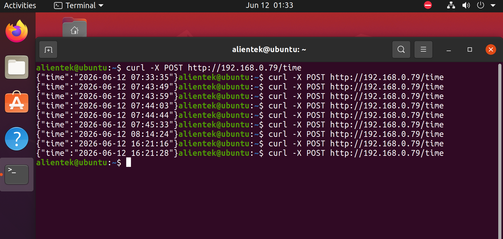

# ESP32 RESTful 時間伺服器 (C 語言輕量級 HTTP Web Server 實作)

[](https://docs.espressif.com/projects/esp-idf/en/latest/esp32/)
[]()
[]()

本專案基於 **ESP-IDF 原生 HTTP 伺服器元件（`esp_http_server`）**，實現了一個輕量級的嵌入式 REST API 時間伺服器。ESP32 啟動後會主動連線 Wi-Fi 並透過 NTP 伺服器校正內部時鐘，隨後在 Port 80 監聽 HTTP 請求，允許外部客戶端透過系統指定的 `POST /time` 路由，以非阻塞方式取得當前晶片機內的精準時間（以標準 JSON 格式格式化返回）。

---

## 🎯 專案核心技術特點

1. **原生輕量級 HTTP 伺服器 (`esp_http_server`)**：不依賴龐大的第三方 Web 框架，純 C 語言原生實作 Port 80 的 HTTP Server 引擎，具備極低的記憶體（RAM）佔用與高應答速度。
2. **標準 RESTful API 設計**：封裝自訂 URI 控制器（`httpd_uri_t`），精準綁定 `HTTP_POST` 方法與 `/time` 路由，實現標準的微服務架構設計。
3. **JSON 格式動態封裝**：底層處理常規時間結構體（`struct tm`）並透過 `strftime()` 轉換，動態拼裝出完全符合工業標準的 `{"time":"YYYY-MM-DD HH:MM:SS"}` 數據流，並強制指定回應標頭為 `application/json`。
4. **穩健的聯網與校時鏈條**：採用 FreeRTOS 事件組機制，確保 Wi-Fi 連線成功取得 IP 後，才無縫觸發 SNTP（`pool.ntp.org`）自動校時，校時完成後 Web Server 才會啟動，避免返回初始化前的無效時間戳。

---

## 📂 專案檔案結構

```text
├── CMakeLists.txt          # 專案建構腳本 (需註冊 esp_http_server 依賴)
├── README.md               # 本說明文件 (即本檔案)
└── main
    └── REST.c              # 核心主程式 (包含 Wi-Fi、NTP、HTTP 核心與 JSON 處理)
🛠️ main/CMakeLists.txt 必要元件註冊
為了確保編譯器能順利引用 esp_http_server.h，請確保你的 main/CMakeLists.txt 的 REQUIRES 清單中包含 esp_http_server：

CMake
idf_component_register(SRCS "REST.c"
                    INCLUDE_DIRS "."
                    REQUIRES esp_wifi esp_netif esp_event nvs_flash esp_http_server)
💻 外部測試與數據抓取驗證 (cURL Test)
當 ESP32 成功連線並啟動 HTTP 服務後，你可以使用電腦的終端機（CMD / PowerShell / Linux Terminal），利用 curl 工具主動向 ESP32 發送連線請求。

📡 測試命令
請將下方命令中的 192.168.1.1XX 替換為你的 ESP32 實際上線後取得的 IP 位址：

Bash
curl -X POST http://192.168.1.1XX/time

📥 預期回傳結果 (JSON Response)
伺服器將會以高速響應標準的 JSON 字串，完美與主流 API 介面工具對接：

JSON
{"time":"2026-06-12 15:47:32"}

📊 序列埠預期日誌輸出 (Log Output)
當系統部署執行時，終端機 Monitor 將展現流暢的階段式初始化與監聽狀態：

Plaintext
I (542) REST_TIME_SERVER: Connecting WiFi...
I (1820) REST_TIME_SERVER: Got IP: 192.168.1.105
I (1820) REST_TIME_SERVER: Starting SNTP...
I (2450) REST_TIME_SERVER: Time synchronized
I (2460) REST_TIME_SERVER: HTTP Server Started
當外部電腦每執行一次 curl -X POST 請求，ESP32 都會立即捕獲並即時印出追蹤日誌：



Plaintext
I (12540) REST_TIME_SERVER: POST /time
I (18920) REST_TIME_SERVER: POST /time
💡 開發架構剖析備忘錄
為什麼使用 HTTP_POST 而不是 GET？
在傳統 RESTful 的設計理念中，GET 用於獲取靜態資源，而 POST 用於觸發伺服器內部的某項運算或特定動作。此處採用 POST 請求，能更安全地向 ESP32 核心引擎發起「即時截取硬體 RTC 時間並進行格式化」的主動命令。

記憶體安全與響應長度處理：
在發送響應時，使用了 HTTPD_RESP_USE_STRLEN 巨集。這能讓底層 API 自動呼叫 strlen(response) 來動態計算資料長度，免去了開發者手動計算緩衝區長度（Content-Length）出錯而導致網路封包被截斷或溢位的安全隱患。

📝 授權條款 (License)
本專案採用 MIT 授權條款 開源發布。你可以自由地複製、修改、合併、發布、分發、再授權及/或銷售本軟體的副本，惟須在所有副本中包含下方的版權聲明與許可聲明。

其完整法律文本如下：

Plaintext
MIT License

Copyright (c) 2026 mt1215

Permission is hereby granted, free of charge, to any person obtaining a copy
of this software and associated documentation files (the "Software"), to deal
in the Software without restriction, including without limitation the rights
to use, copy, modify, merge, publish, distribute, sublicense, and/or sell
copies of the Software, and to permit persons to whom the Software is
furnished to do so, subject to the following conditions:

The above copyright notice and this permission notice shall be included in all
copies or substantial portions of the Software.

THE SOFTWARE IS PROVIDED "AS IS", WITHOUT WARRANTY OF ANY KIND, EXPRESS OR
IMPLIED, INCLUDING BUT NOT LIMITED TO THE WARRANTIES OF MERCHANTABILITY,
FITNESS FOR A PARTICULAR PURPOSE AND NONINFRINGEMENT. IN NO EVENT SHALL THE
AUTHORS OR COPYRIGHT HOLDERS BE LIABLE FOR ANY CLAIM, DAMAGES OR OTHER
LIABILITY, WHETHER IN AN ACTION OF CONTRACT, TORT OR OTHERWISE, ARISING FROM,
OUT OF OR IN CONNECTION WITH THE SOFTWARE OR THE USE OR OTHER DEALINGS IN THE
SOFTWARE.